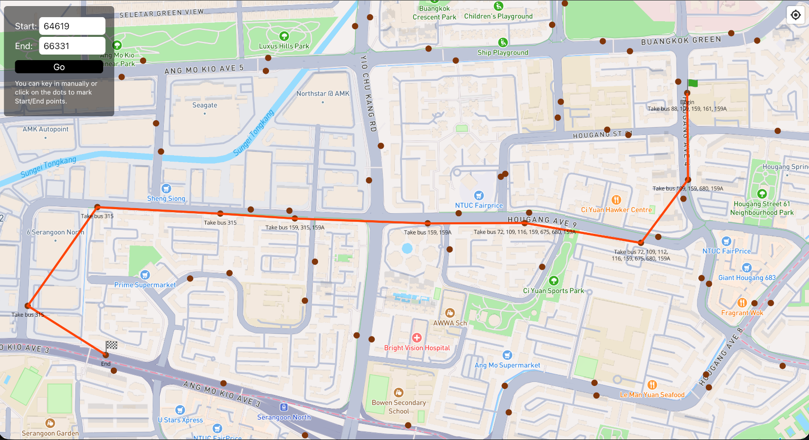

# FindPathSG

FindPathSG is an application that calculates paths between a selected start and end point. It also provides information on which buses # to transfer between along the route.

This project is an experiment in applying the A* pathfinding algorithm to Singapore’s bus network.

## Credits

- Data Taken from: [sgbusdata](https://github.com/cheeaun/sgbusdata) .
